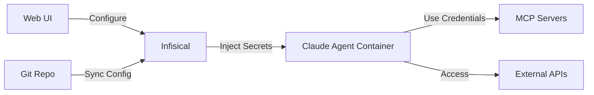

# Credential Management Solutions Analysis (2024-2025)

## Executive Summary
For containerized Claude Code agent platform, **Infisical** emerges as the optimal choice for credential management, combining true open source licensing, modern architecture, developer-friendly experience, and excellent Docker/Kubernetes integration.

## Detailed Comparison Matrix

### Open Source Solutions

| Solution | License | Docker Support | Complexity | Cost | Best For |
|----------|---------|---------------|------------|------|----------|
| **Infisical** | MIT (true OSS) | Native, simple | Low | Free core, $15/dev/mo Pro | Modern teams, containers |
| **OpenBao** | MPL 2.0 | Yes, testing focus | High | Free | Vault users wanting OSS |
| **External Secrets Operator** | Apache 2.0 | Kubernetes-native | Medium | Free | K8s-heavy environments |

### Commercial Solutions

| Solution | License | Docker Support | Complexity | Cost | Best For |
|----------|---------|---------------|------------|------|----------|
| **HashiCorp Vault** | BSL (not OSS) | Yes, complex | Very High | Enterprise pricing | Large enterprises |
| **Bitwarden Secrets** | Source available | Good | Low | User-based pricing | Security-focused orgs |
| **Doppler** | Proprietary | Excellent | Low | $0-3 users, $21/user/mo | Managed solution seekers |
| **Akeyless** | Proprietary | Yes | Medium | Custom pricing | Enterprise, 70% TCO savings |

## Top Recommendation: Infisical

### Why Infisical for Claude Agent Container

1. **Docker-First Design**
   ```bash
   # Simple deployment
   git clone https://github.com/Infisical/infisical
   cp .env.example .env
   docker-compose up
   ```

2. **Developer Experience**
   - Web UI for credential management (perfect for your use case)
   - CLI that transitions from .env files
   - SDKs for Node, Python, Java, .NET
   - REST API for custom integrations

3. **Security Features**
   - End-to-end encryption
   - Zero-knowledge architecture
   - Secret versioning and audit logs
   - Time/view-limited secret sharing

4. **Integration Capabilities**
   - Native Docker/Kubernetes support
   - Environment variable injection
   - MCP server compatibility
   - Git-backed configuration

5. **Pricing**
   - Free core edition (unlimited secrets, 5 users)
   - Pro at $15/dev/month for teams
   - Self-hosted option available

### Implementation in Your Architecture

```yaml
# docker-compose.yml addition
services:
  infisical:
    image: infisical/infisical:latest
    ports:
      - "8081:80"  # Separate from your web UI
    environment:
      - ENCRYPTION_KEY=${INFISICAL_KEY}
    volumes:
      - infisical-data:/var/lib/infisical

  claude-agent:
    depends_on:
      - infisical
    environment:
      - INFISICAL_URL=http://infisical:80
      - INFISICAL_TOKEN=${INFISICAL_TOKEN}
```

## Alternative Recommendations

### If You Need Maximum Simplicity: Doppler
- **Pros**: 5-10 minute setup, 50+ integrations, fully managed
- **Cons**: Not open source, $21/user/month after 3 users
- **Best for**: Teams wanting zero maintenance

### If You Need Vault Compatibility: OpenBao
- **Pros**: Drop-in Vault replacement, Linux Foundation backed
- **Cons**: Complex setup/maintenance, early stage project
- **Best for**: Existing Vault users needing OSS

### If You're Kubernetes-Native: External Secrets Operator
- **Pros**: Works with existing secret stores, GitOps friendly
- **Cons**: Requires existing secret backend
- **Best for**: K8s environments with existing secret stores

## Integration Architecture for Claude Agent



### Credential Flow
1. User enters credentials via web UI
2. Credentials encrypted and stored in Infisical
3. Claude agent requests secrets at runtime
4. Infisical injects as environment variables
5. MCP servers receive credentials securely
6. No credentials in code or config files

## Implementation Steps

### Phase 1: Infisical Setup
```bash
# 1. Deploy Infisical alongside Claude container
docker-compose up -d infisical

# 2. Initialize Infisical
infisical init

# 3. Create project for Claude agent
infisical projects create --name "claude-agent"
```

### Phase 2: Web UI Integration
```python
# FastAPI endpoint for credential management
from infisical_client import InfisicalClient

@app.post("/api/credentials")
async def store_credential(service: str, credentials: dict):
    client = InfisicalClient(token=INFISICAL_TOKEN)
    client.create_secret(
        environment="production",
        name=f"{service}_CREDENTIALS",
        value=json.dumps(credentials),
        type="shared"
    )
    return {"status": "stored"}
```

### Phase 3: Claude Agent Integration
```json
// .mcp.json with Infisical injection
{
  "mcpServers": {
    "google-workspace": {
      "command": "mcp-server-google",
      "env": {
        "GOOGLE_CREDENTIALS": "${INFISICAL:GOOGLE_CREDENTIALS}"
      }
    }
  }
}
```

## Security Best Practices

1. **Encryption at Rest**: Use Infisical's built-in encryption
2. **Secret Rotation**: Configure automatic rotation for API keys
3. **Access Control**: Use Infisical's RBAC for team members
4. **Audit Logging**: Enable comprehensive audit trails
5. **Network Isolation**: Keep Infisical internal to Docker network
6. **Backup Strategy**: Regular encrypted backups to S3/Git

## Cost Analysis

### For 5-Person Team
- **Infisical**: $0 (free tier)
- **Doppler**: $63/month
- **Bitwarden**: ~$50/month
- **Vault**: $thousands/year + operational costs

### For 20-Person Team
- **Infisical**: $300/month (Pro)
- **Doppler**: $420/month
- **Bitwarden**: ~$200/month
- **Vault**: Enterprise pricing + DevOps team

## Final Recommendation

**Use Infisical** for your Claude Agent container platform because:
1. True open source (MIT license)
2. Simple Docker deployment
3. Modern UI matching your requirements
4. Cost-effective scaling
5. Active development and community (16K+ GitHub stars)
6. Native support for your use case

**Fallback Option**: If Infisical doesn't meet needs, use Doppler for fully managed solution or OpenBao for Vault compatibility.